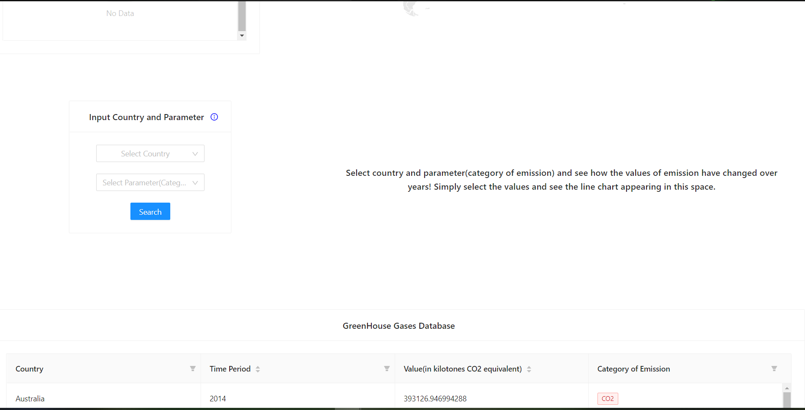
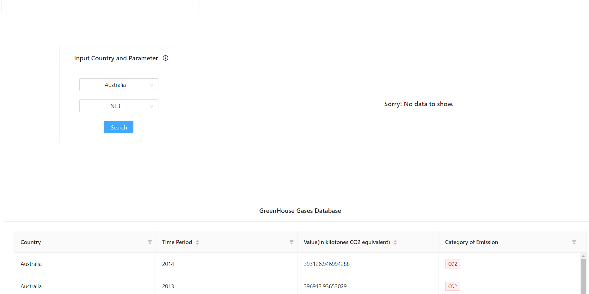
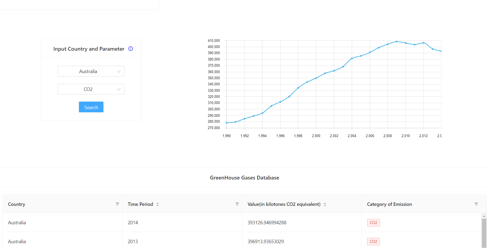

# Visualization of International Greenhouse Gas Emissions Dataset

A React Application to visualize [International Greenhouse Gases Dataset](https://www.kaggle.com/unitednations/international-greenhouse-gas-emissions) .

 
Deployed on [https://frosty-mcnulty-66df76.netlify.app/](https://frosty-mcnulty-66df76.netlify.app/) .

## Libraries Used:
1. Ant Design : for better visualization of dataset (Antd Tables, Input fields and also Card component used)
2. country-list : for getting the country codes of the countries selected (used in map visualization)
3. react-jvectormap : for visualization of world map and to customize world map according to dynamic data
4. react-router-dom : for routing purposes 
In the project directory, you can run:

### `yarn install`

Installs all the necessary node modules.
### `yarn start`

Runs the app in the development mode.\
Open [http://localhost:3000](http://localhost:3000) to view it in the browser.
### `Basic Documentation of code`

1. The app is divided into several components.
2. Both functional and class components have been used.
3. In the components folder in pages folder in src, you will find five files:
   
  --> input.js : where the input taken from the input box(i.e. the year) is stored as state and when 'search' button pressed, is passed in the URL as value of parameter 'query'. This input value is used to find out the name of multiple countries and also their corresponding data of values and categories of emission in table format in the same time period. Also pointing of those countries only and their corresponding data is done in the map, with the help of tooltips.
   
  
   
  Validation is also attached to the input box to accept input values within the range of 1990 and 2014 as per the dataset.
   
  
   
  
   
  --> table.js : where the whole json file is shown in proper table format along with filters and sorter in the columns.
   
  
   
   
  -->intro.js: simply contains the component that appears at the top of the page, i.e. the short introduction.
   
  
   
  -->chart.js:where the inputs of country and category(parameter) are taken from the respective dropdowns. The selected values are stored as state and when 'search' button pressed, is passed in the URL as value of parameters 'country' and 'category' respectively. These values are used to plot line chart between the years and the value of the emissions of that particular category. If data is not present, then a message telling that no data was found, is shown in place of the line chart.
    
  
   
  
   
  
   
  --> sort.js: used to arrange a 2d array in ascending order of the first values of each included array parts.
4. mainpage.js collects all the component and places them orderly. React Lazy loading is used for better user experience and also for improving page performance.
5. output.json contains the dataset .
6. For getting the value for the parameter 'query' in URL and setting it in the URL, the two files paramlocation.js and setparams.js are used.
7. App.js : used for routing purposes.
8. For getting the value for the parameters 'country' and 'category' in URL and setting it in the URL, the two files pathlocation.js and setpath.js are used.

## 🚀 Contribution

If you want to contribute to this project, follow the gudelines in [CONTRIBUTING.md](https://github.com/procheta1999/greenhouse_gases/blob/master/CONTRIBUTING.md)

This project follows the [all-contributors](https://github.com/all-contributors/all-contributors) specification. Contributions of any kind welcome!
